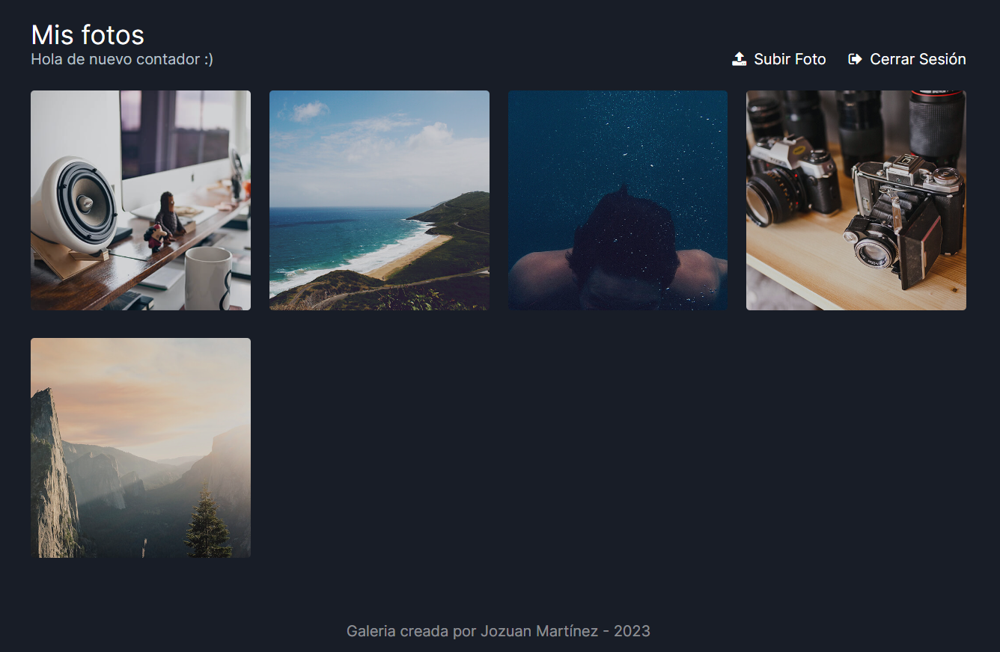
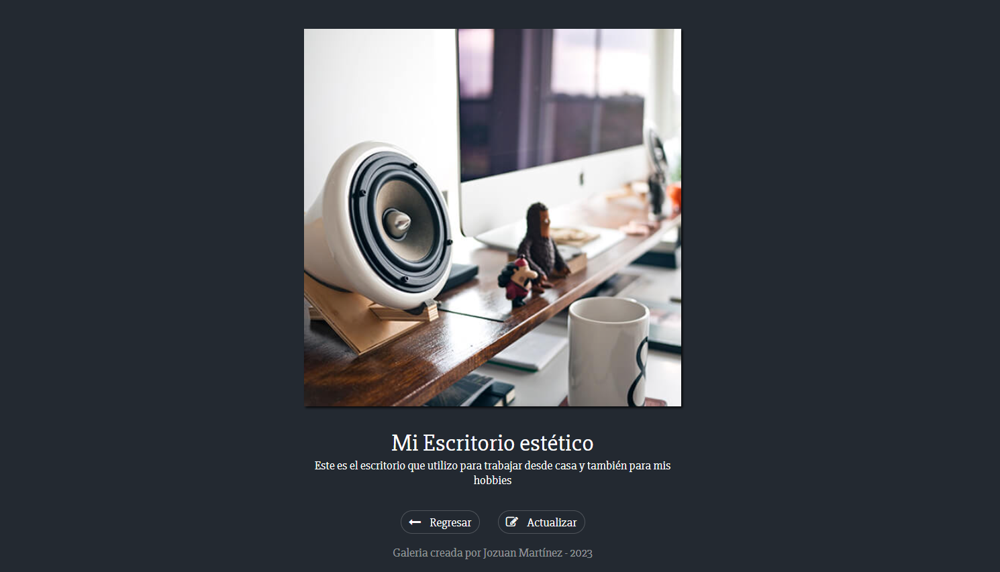
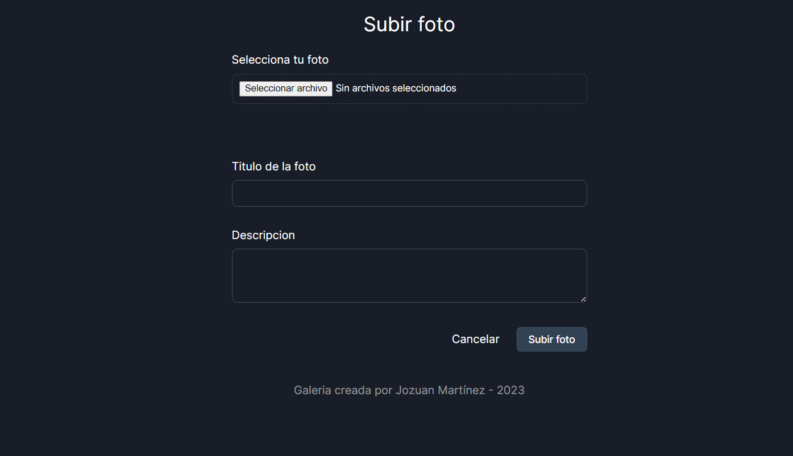

# Gallery PHP

A simple image gallery web application created using PHP, HTML, CSS, JavaScript, and MySQL.

## Motivation

This project was developed to enhance my PHP skills and serve as a learning exercise. It's inspired by the project from the Falcon Master PHP Course.


## Features

- **Image Upload:** Users can upload images along with titles and descriptions.
- **Image Gallery:** All uploaded images are displayed in a gallery format for easy navigation.
- **Image Management:** Users can edit the titles and descriptions of their uploaded images.

## Getting Started

To run this project locally, follow these steps:

1. **Clone this repository.**

2. **Set up a local web server**: You can use web server software like XAMPP or MAMP. Configure it to run PHP.

3. **Database Setup**: Create a MySQL database and define the required table using the following SQL code:

   ```sql
   CREATE TABLE photos (
       id INT AUTO_INCREMENT PRIMARY KEY,
       title VARCHAR(50) NOT NULL,
       description VARCHAR(255) NOT NULL,
       img_url VARCHAR(255) NOT NULL
   );
4. **Environment Variables**: Rename the .env.template file to .env and update the variable values as needed.

5. **Access the Project**: Open the project in your web browser.


## Screenshoots

Home Page


Details Page


Upload Page

